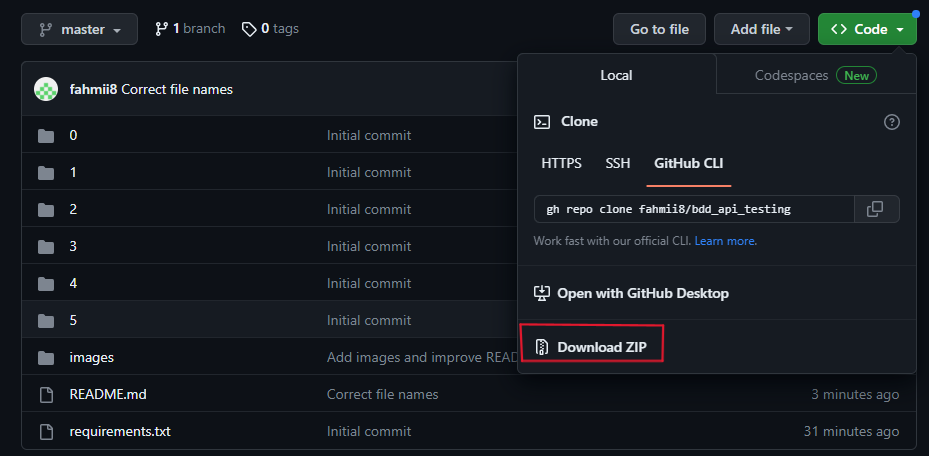
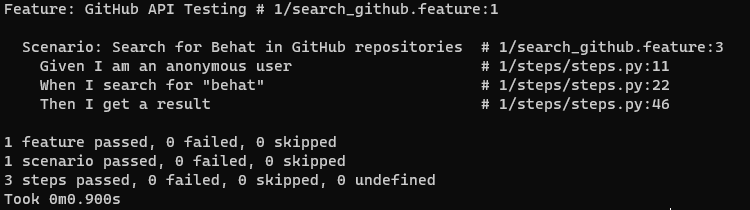
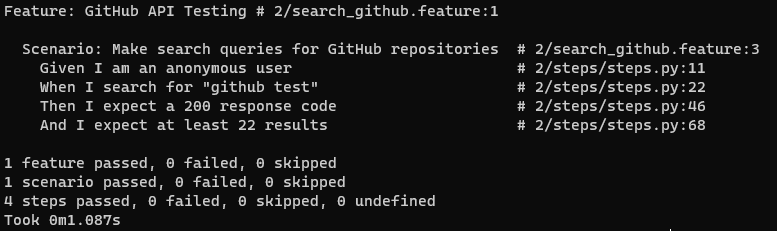
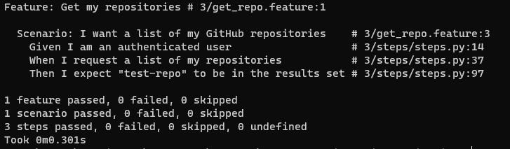
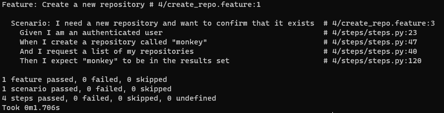
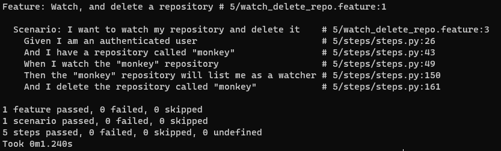

# Welcome to the API Testing and Validation Course!

This course focuses primarily on testing APIs from the consumer point of view, as part of BDD (behavior-driven development). 

The __course on LinkedIn Learning and the practice files are outdated__, but using the files in this folder will allow you to practice the same material, except with __Python instead of PHP__.

---

# Table of Contents:
1. [Setup:](#1-setup)    
   1.1 [Download Files](#11-download-files)    
   1.2 [Installing Python](#12-installing-python)     
   1.3 [Installing Required Python Libraries](#13-installing-required-python-libraries)      
   1.4 [Setting up GitHub](#14-setting-up-github)    
   1.5 [Installing Postman](#15-installing-postman)
2. [Getting Started](#2-getting-started)
3. [Running the Tests](#3-running-the-tests)

---


## 1. Setup:


### 1.1 Download Files

You will first have to download the files within this repository. You can do this by either downloading a .zip of the repo by selecting the green 'code' button and then 'Download ZIP:


or by running the following command if you have the GitHub CLI installed:

```
gh repo clone fahmii8/bdd_api_testing
```


### 1.2 Installing Python

You must have a valid installation of Python. If you don't, you can download it from the following website:  
https://www.python.org/downloads/  
In order to make sure that your Python installation is working, type the following into CMD / PowerShell / Terminal:

```
python --version
```

The response you get should look something like:

```
Python 3.11.2
```

You may not have the exact same Python version, but as long as it is __version 3.7+, you are good to go__. If you receive an error, your installation of Python may have failed, or you need to add the python exe file to your PATH variables (you may find [this link](https://datatofish.com/add-python-to-windows-path/) helpful if you are having issues).

### 1.3 Installing Required Python Libraries

A few Python libraries are required to ensure functionality:

1. __behave__ : a BDD testing framework that follows a Gherkin-like syntax for defining test scenarios, similar to Behat for PHP
2. __urllib__ : this will make it easier to encode certain queries that get posted to the APIs that you will use
3. __requests__ : library that makes it possible to send and receive HTTP requests to various APIs

To install these libraries, type the following into CMD / PowerShell / Terminal:

```
pip install -r requirements.txt
```

This will pull the requirements from the 'requirements.txt' file in this folder, and install the required libraries into your environment. 

### 1.4 Setting up GitHub

The majority of this course will make use of the GitHub REST API. An __active GitHub account is required__ for many of the practice exercises as well. 

You can create a GitHub account at the following page: [GitHub.com](https://github.com)

To authenticate yourself with the GitHub API, you will also need a __Bearer Token__ that you will send alongside your requests. This will be required for some of the later practice exercises. 

To get a Bearer Token:

1. Once logged in, select on your profile icon on the top right of the page
2. Select 'Settings'
3. From the various categories on the left, scroll down and select 'Developer Settings'
4. Select 'Personal access tokens'
5. Select 'Tokens (classic)'
6. Select 'Generate new token' and authenticate yourself in the GitHub login page if required
7. For 'expiration', select how long you want this token to be valid for (I would suggest 7 days)
8. Under 'Select Scopes', check everything, or you can find more information [here](https://docs.github.com/en/authentication/keeping-your-account-and-data-secure/creating-a-personal-access-token) regarding each of the choices
9. Select "Generate token' and copy your token
10. Save your token somewhere safe, it will be required later on in this course

After creating your bearer token, __create a repository__ to test with the API:

1. Go to your GitHub profile
2. Select 'Repositories'
3. Select the green 'New' button
4. Give the repository a name then select the 'Create repository' button

### 1.5 Installing Postman

Postman will be incredibly useful to test out your HTTP requests to the GitHub API, and to see what information gets returned. When using behave, we are only testing for functionality, and we won't get to see the actual response from the API. Using Postman, we can send the requests and see what the API response is. 

You can install Postman by from the following link: [Postman download](https://www.postman.com/downloads/). 

Review the prior Postman courses if necessary to get a refresher on how to use Postman to send HTTP requests. As you go along in the course, try sending the HTTP request via Postman before testing it out with behave. 

---

## 2. Getting Started

There are 5 folders named 1-5 located within the 'api_testing_validation' folder. Each folder is for a different part of the course. 

Folder 0 is a test folder that contains an API endpoint to a API testing website. If you are having issues with the GitHub API, you may want to test out the endpoint in folder 0. 

The __folder names represent sequential steps__ as you go through the course; folder '1' will contain the first test, while folder '5' will contain the final test. 


Each folder will contain a '[file_name].feature' file, and a sub-folder named 'steps'. Within the 'steps' folder will exist a python file named 'steps.py' __Do not move around the files, add new files, or rename the files.__

The [file_name].feature file will be where you type in Gherkin syntax BDD API testing scenarios. You can follow the course for what should be included in these files, or you can go off of what is already in the file. I strongly encourage you to change things around to see what happens. 

The 'steps.py' file is where you can find the actual Python code that is sending requests to the APIs and handling the Gherkin syntax scenario. 

This is not a Python course, but I do encourage you to try to understand how the code is working. 

As a quick tip, the decorators handle the pattern of text found within the [file_name].feature file. 
For example, the following scenario:

`
Given I am an authenticated user
`

will be associated with the following decorator:

```py
@given("i am an {user_type} user")
```

If the scenario matches the decorator, then the decorated function will be activated. 

For more info on how all of this works, check out the [behave docs](https://behave.readthedocs.io/en/stable/) or feel free to reach out to me. 


Within __folders 3, 4, and 5, the steps.py file will contain a spot for you to paste your Bearer Token__ into on line 5. 

It should look like the following:

```py
BEARER_TOKEN = "sdp_inisfd893wiusodifj03980sjefsj3o0"
```

__Folder 5 will also have a spot for you to put in your GitHub username__ on line 6. 

---

## 3. Running the Tests

To actually run the scenario and tests that you put into your [file_name].feature file, open CMD / PowerShell / Terminal and navigate to the api_testing_validation folder. Then, type 'behave' followed by the folder number into CMD / PowerShell / Terminal. 

For example, if we wanted to conduct the first test, we would type the following:

```
behave .\1\
```

Then hit enter, and the test will run and the results will be shown. If you receive any errors, read through the response and fix any issues that it detected. 

The following screenshots will display successful results for each of the 5 folders / tests:

1:
```
behave .\1\
```


2:
```
behave .\2\
```


3:
```
behave .\3\
```


4:
```
behave .\4\
```


5:
```
behave .\5\
```


Good luck and reach out if you have any issues!
